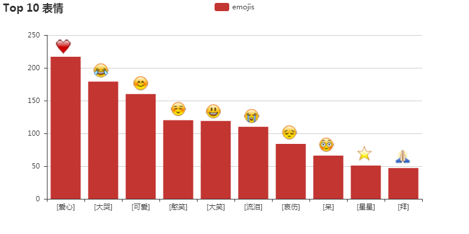

# gulius-projects
收录古柳（DesertsX）的一些小项目

## [当你点开这首《八月》的歌：9400余条评论的分析与挖掘](https://zhuanlan.zhihu.com/p/41516392) 
[八尾旅人的日文歌曲《八月》](https://music.163.com/#/song?id=29450761)在网易云音乐里评论数高达9千余条，而且我注意看到8月1号当天许多人和我一样都是因为八月伊始才搜到这首歌并留言的，有感于在无从知晓的地方的人们有着如此相似的想法与行为，于是本项目对这样一首以月份为主题的歌曲的评论进行简单分析、挖掘和可视化，其中爬取歌曲全部9400余条评论（截止2018-08-06晚上），爬虫代码是很久前 Python 交友娱乐会所群（QQ 群：613176398，这不是 ads 系列）里有人分享的现成的，出处未做考证，不过由此免去了破解反爬、破解JS加密之苦，可以更专注于后续步骤。若对爬虫感兴趣的可以看下这个话题：[如何爬网易云音乐的评论数？](https://www.zhihu.com/question/36081767/answer/140287795) 。读者可以边听着歌边看本文或运行代码。

---
## [“中国年轻人正带领国家走向危机”，这锅背是不背？](https://zhuanlan.zhihu.com/p/41880873)
即：《手把手教你完成一个数据科学小项目》系列
正所谓：“人在家中坐，锅从天上来”，面对新浪财经《中国年轻人正带领国家走向危机？》如此耸人听闻的言论，且来看看读者的反应是怎样的，舆论会是如何。

